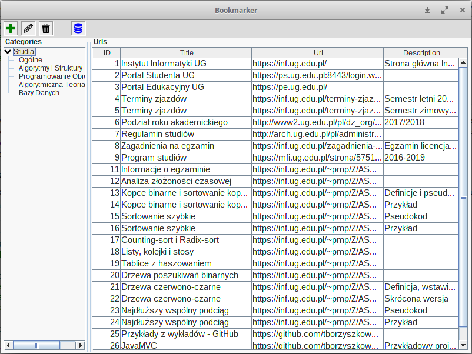
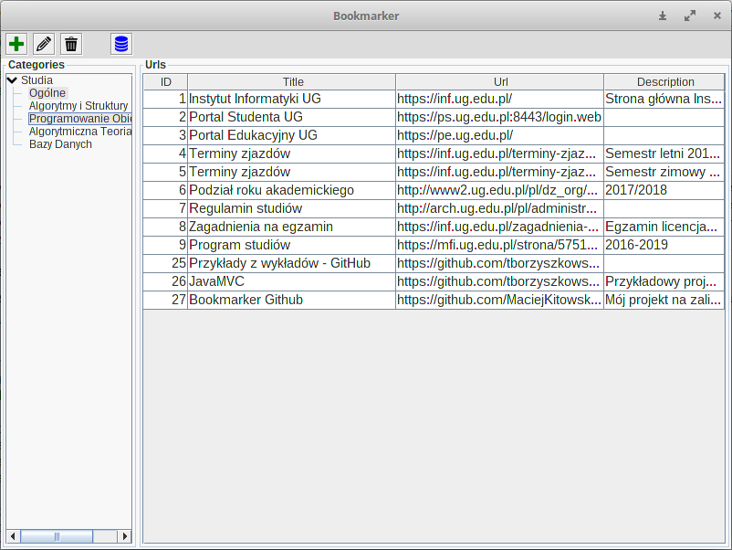
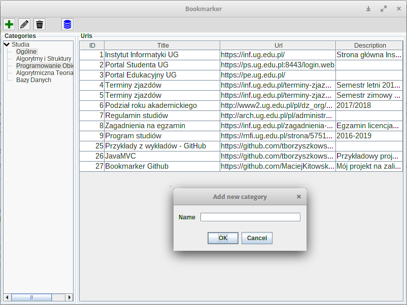
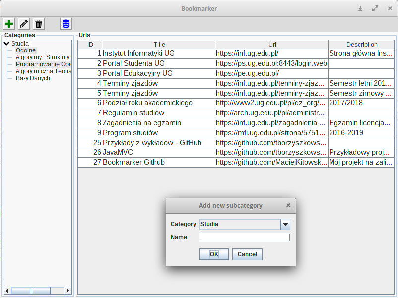
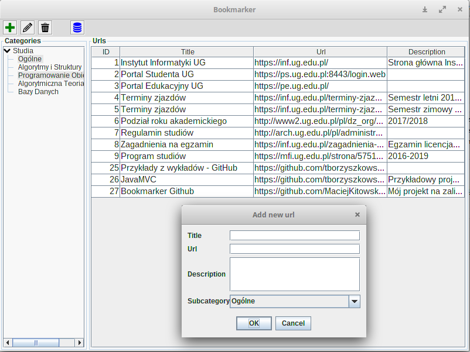
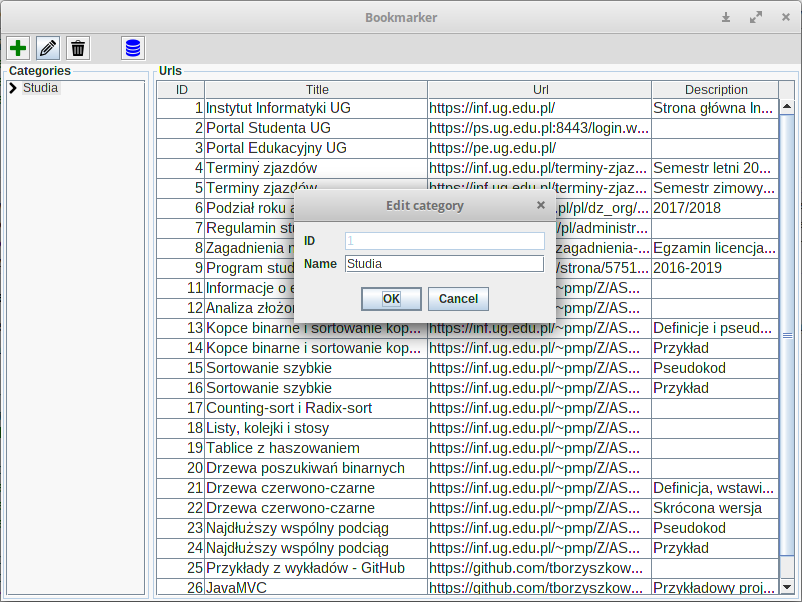
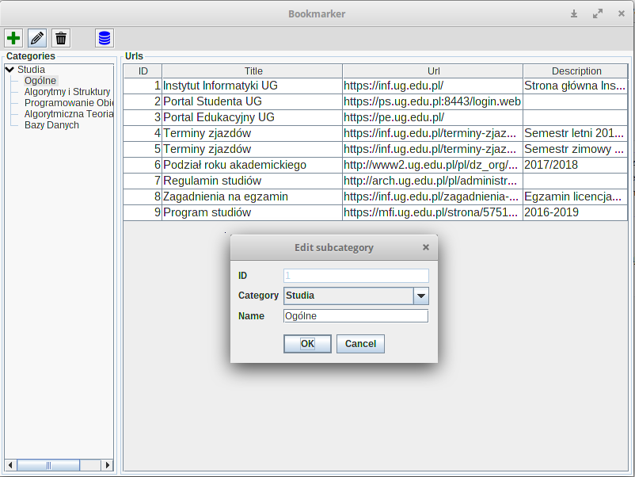
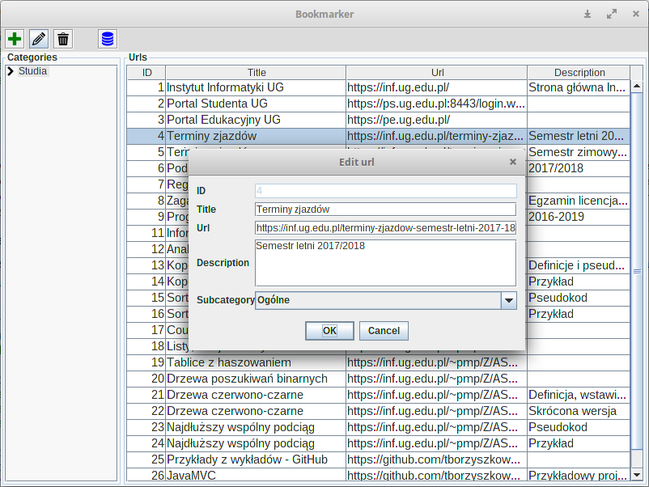

# Bookmarker
Univeristy project on Object-oriented Programming (part-time BSc studies of Computer Science on University of Gdansk - 2017/2018 winter semester)

# Configuration
## Project
### Resources
Add to your project classpath reference to ***resources*** directory.  

#### Useful pages
* [How do I add a directory to the eclipse classpath?](https://stackoverflow.com/a/25163361)
* [how to add directory to classpath in an application run profile in intellij idea?](https://stackoverflow.com/a/24843914)

### Dependencies
Project use maven for dependency management.  

#### Used libraries
* JSON In Java *(ver. 20171018)* - [source](https://mvnrepository.com/artifact/org.json/json/20171018)
* MySQL Connector *(ver. 5.1.44)* - [source](https://mvnrepository.com/artifact/mysql/mysql-connector-java/5.1.44)
* PostgreSQL JDBC Driver *(ver. 42.1.4)* - [source](https://mvnrepository.com/artifact/org.postgresql/postgresql/42.1.4)
* SQLite JDBC *(ver. 3.20.0)* - [source](https://mvnrepository.com/artifact/org.xerial/sqlite-jdbc/3.20.0)
* Apache Commons IO *(ver. 1.3.2)* - [source](https://mvnrepository.com/artifact/commons-io/commons-io/1.3.2)
* JUnit *(ver. 4.12)* - [source](https://mvnrepository.com/artifact/junit/junit/4.12)
* SLF4J API Module *(ver. 1.7.25)* - [source](https://mvnrepository.com/artifact/org.slf4j/slf4j-api/1.7.25)*
* Logback Classic Module *(ver. 1.2.3)* - [source](https://mvnrepository.com/artifact/ch.qos.logback/logback-classic/1.2.3)**
* Logback Core Module *(ver. 1.2.3)* - [source](https://mvnrepository.com/artifact/ch.qos.logback/logback-core/1.2.3)

> \* - *SLF4J API Module* should be before *Logback Classic Module*  
> \** - *Logback Classic Module* should be before *Logback Core Module*

## Database
### SQLite
SQLite database don't need any configuration.

### MySQL & PostgreSQL
1. Instal MySQL/PostgreSQL server
2. Add new database
3. Add new user called *bookmarker*\* with password *admin1*\* and **grant him all permissions to created database**

> \* - Username and password can be changed in *MysqlFactory/PostgresFactory* class

#### Useful pages (MySQL)
* [How To Install MySQL on Ubuntu](https://www.digitalocean.com/community/tutorials/how-to-install-mysql-on-ubuntu-16-04)
* [Creating and Selecting a Database](https://dev.mysql.com/doc/refman/5.7/en/creating-database.html)
* [How To Create a New User and Grant Permissions in MySQL](https://www.digitalocean.com/community/tutorials/how-to-create-a-new-user-and-grant-permissions-in-mysql)

#### Useful pages (PostgreSQL)
* [How To Install and Use PostgreSQL on Ubuntu ](https://www.digitalocean.com/community/tutorials/how-to-install-and-use-postgresql-on-ubuntu-16-04)
* [PostgreSQL - CREATE Database](https://www.tutorialspoint.com/postgresql/postgresql_create_database.htm)
* [Create a user with the command line](https://www.ntchosting.com/encyclopedia/databases/postgresql/create-user/#Create_a_user_with_the_command_line)
* [Add privileges to a user](https://www.ntchosting.com/encyclopedia/databases/postgresql/create-user/#Add_privileges_to_a_user)

# Screenshots

        
        </img> 
        </img>
        </img>
        </img>
        </img>
        </img>
        </img>

