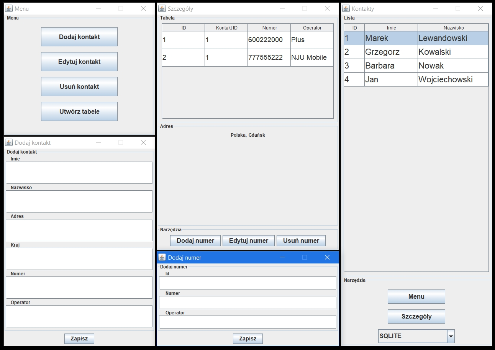

# Phonebook
University project on Object-oriented Programming (part-time BSc studies of Computer Science on University of Gdansk - 2017/2018 winter semester)   
**Author:** Janusz Schőnrock  
**Github:** https://github.com/johnnyrock92  
**Linkedin:** www.linkedin.com/in/janusz-schonrock/

#### Used libraries
* MySQL Connector *(ver. 5.1.44)* - [source](https://dev.mysql.com/downloads/connector/j/5.1.html)
* SQLite JDBC *(ver. 3.8.6)* - [source](https://bitbucket.org/xerial/sqlite-jdbc/downloads/)

## Database
### SQLite
SQLite database don't need any configuration.

### MySQL
1. Install MySQL
2. If you don't find database named "test" add new database named "test"
3. Username: root

# Screenshot

        

